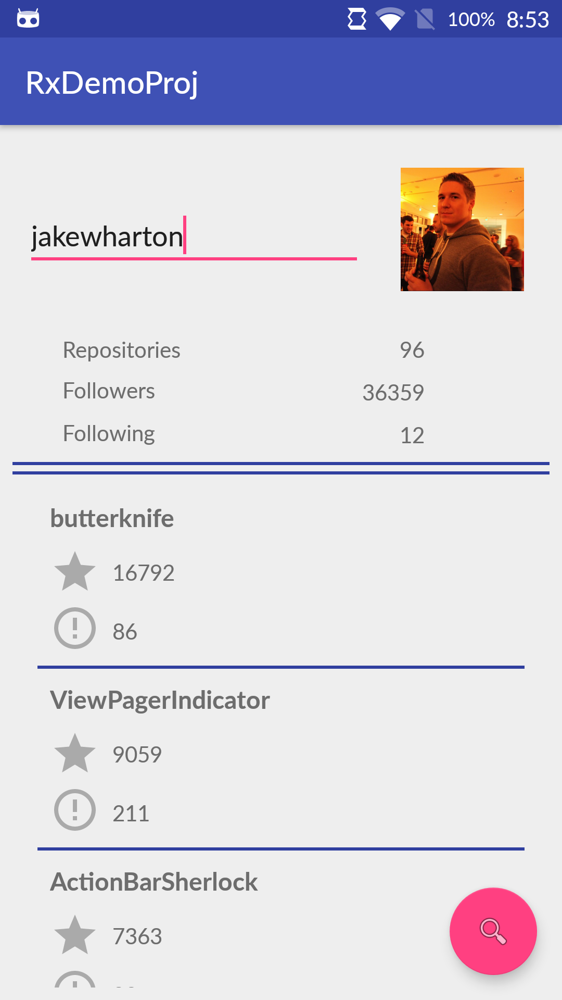

# RxDemoProj
##### !!! Note: Requires atleast Android Studio 3.0 Canary 4 to build because of native lambda & method reference support!

RxDemoProj is a demonstrational project which makes use of several technologies & paradigms. Considering TODO apps are gettings stale in execution, I wanted to try and make an app which is as basic as a TODO app but is a little more interesting in functionality. 

##### RxDemoProj has 2 main features:
1. ###### Github user search
This feature is implemented using an EditText which will dynamically/reactively search for user based on the username input. If the username is not found, a value of '-1' will be displayed for all values. If the username is found however, the profile picture along with some extra data will be displayed.

2. ###### Listing (up to 10) most popular repositories of searched user
Once a valid use has been found, you can press the Floating Action Button to trigger a search for (up to) the 10 most popular repositories of said user based on the number of stars. These will be displayed in a RecyclerView below the user data. If the repository is a forked one, the view will display the 'forked' symbol on the right hand side.

##### A listing of the concepts and technologies used can be found below: 

- Reactive Programming with RxJava2
- Clean Architecture w/ package-by-feature
- MVVM
- Volley w/ REST API calls & filtering using JsonPath
- RecyclerView
- ConstraintLayout
- Java 8 lambda's & method references
- Timber logging

##### Screenshot:
